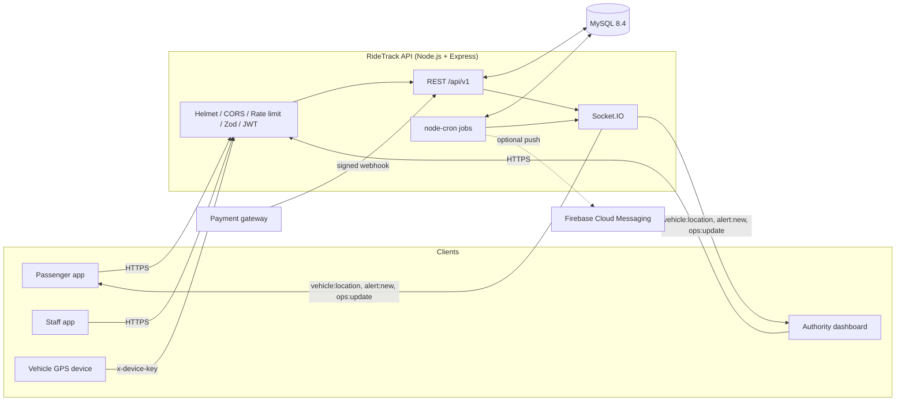
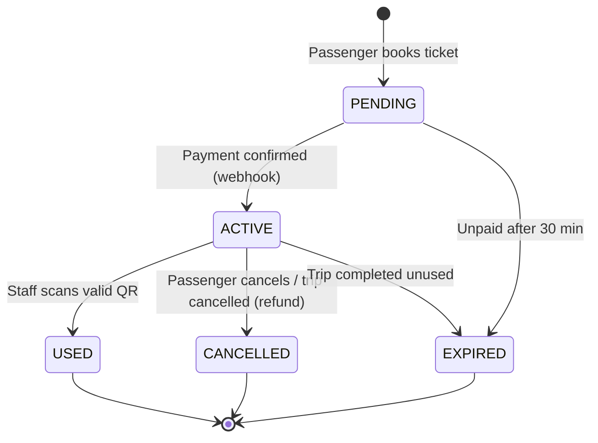
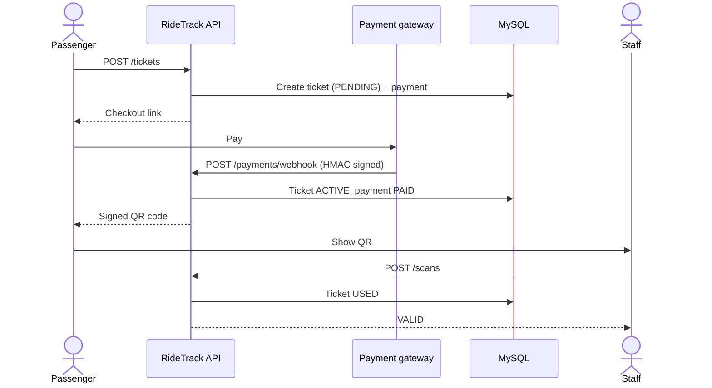
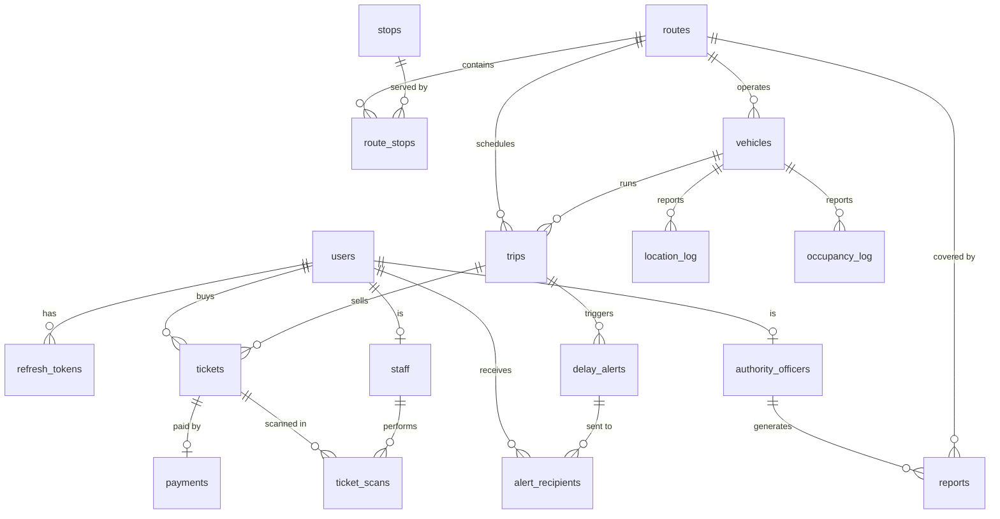

<div align="center">

# 🚍 RideTrack API

**Real-time public transport backend for buses and trains.**<br>
Live tracking · QR ticketing · Payments · Delay alerts


[](https://github.com/sithira-janiya/Ride-Track-Backend/commits/main)
[](https://github.com/sithira-janiya/Ride-Track-Backend)
[](https://github.com/sithira-janiya/Ride-Track-Backend/issues)
[](https://github.com/sithira-janiya/Ride-Track-Backend)


[**Quick start**](#-quick-start) · [**Architecture**](#-architecture) · [**API**](#-api-reference) · [**Real-time**](#-real-time-events) · [**Testing**](#-testing)

</div>

---

## 📊 At a glance

<!-- STATS:START -->
<table>
  <tr>
    <td align="center"><h2>51</h2>REST endpoints</td>
    <td align="center"><h2>17</h2>DB tables</td>
    <td align="center"><h2>11</h2>API modules</td>
    <td align="center"><h2>72</h2>automated tests</td>
    <td align="center"><h2>4</h2>background jobs</td>
    <td align="center"><h2>12</h2>runtime deps</td>
  </tr>
</table>
<sub>Generated by <code>npm run readme</code> from the source on 2026-10-10.</sub>
<!-- STATS:END -->

## 🧭 Overview

RideTrack is the REST + WebSocket backend for a public transport app, built around three app roles and an admin:

<table>
  <tr>
    <td width="25%" valign="top"><h3>🧑 Passenger</h3>Browse routes and stops, follow vehicles live, buy tickets, get delay alerts.</td>
    <td width="25%" valign="top"><h3>🎟️ Staff</h3>Scan and validate QR tickets, report vehicle occupancy.</td>
    <td width="25%" valign="top"><h3>🛠️ Authority</h3>Manage routes and trips, watch the live dashboard, publish alerts, run reports.</td>
    <td width="25%" valign="top"><h3>🔐 Admin</h3>Create staff, officer and admin accounts; disable and re-enable accounts.</td>
  </tr>
</table>

GPS devices on vehicles authenticate separately with a shared device key.

## ✨ Features

- 🔐 **JWT auth** with short-lived access tokens, rotating refresh tokens and role-based access control (`PASSENGER`, `STAFF`, `AUTHORITY`, `ADMIN`)
- 🔑 **Separate admin sign-in** with a tighter rate limit, 12-hour sessions, 12+ character passwords and an account check on every admin request
- 📍 **Live tracking**: GPS ingestion, per-route Socket.IO rooms, live ETA vs. timetable
- 🎫 **QR ticketing**: signed QR payloads, staff validation, manual-ID fallback, cancellation
- 💳 **Payments**: pluggable gateway, HMAC-signed webhooks, mock checkout for development
- ⏱️ **Automatic delay detection**: raises an alert when a trip runs 10+ minutes behind
- 🔔 **Alerts** over WebSocket and optional Firebase push notifications
- 📊 **Ops dashboard and reports** for authority officers
- 🖥️ **Admin panel** at `/admin`: a built-in web back office for users, routes, vehicles, trips, tickets, alerts and reports
- 🛡️ **Hardened by default**: Helmet, CORS, rate limiting, Zod request validation, constant-time key comparison
- 🧪 **Integration tests** against a real MySQL test database

## 🏗️ Architecture



### Ticket lifecycle



### Buying a ticket



### Data model



## 🧰 Tech stack

| Layer | Technology |
| --- | --- |
| Runtime | Node.js 20+ (ES modules) |
| Web framework | Express 4, Helmet, CORS, express-rate-limit |
| Real-time | Socket.IO 4 |
| Database | MySQL 8.4 via `mysql2` |
| Validation | Zod |
| Auth | `jsonwebtoken`, `bcryptjs` |
| Scheduling | `node-cron` |
| Testing | Jest, Supertest, socket.io-client |
| Packaging | Docker, Docker Compose |

## 🚀 Quick start

### Prerequisites

- Node.js 20 or newer
- Docker (for MySQL), or your own MySQL 8 instance

```bash
# 1. Install dependencies
npm install

# 2. Configure the environment
cp .env.example .env

# 3. Start MySQL (exposed on port 3307)
docker compose up -d db

# 4. Create the schema and load demo data
npm run migrate
npm run seed

# 5. Run the API with auto-reload
npm run dev
```

The API is now at `http://localhost:3000`. Check it with `GET /health`.

### Run everything in Docker

```bash
docker compose up -d --build
```

This starts MySQL and the API together. The compose file uses throwaway development secrets; set your own for any real deployment.

### Demo accounts

`npm run seed` creates one user per role. All use the demo password from `scripts/seed.js`.

| Role | Email |
| --- | --- |
| 🧑 Passenger | `passenger@ridetrack.test` |
| 🎟️ Staff | `staff@ridetrack.test` |
| 🛠️ Authority | `officer@ridetrack.test` |
| 🔐 Admin | `admin@ridetrack.test` (signs in at `/admin/auth/login`; not seeded when `NODE_ENV=production`) |

> Demo data only. Never seed these accounts into a real deployment.

### Admin panel

Open [http://localhost:3000/admin](http://localhost:3000/admin) and sign in with an authority account (e.g. `officer@ridetrack.test`). From there officers can:

- see live vehicles, delays, today's trips and sales at a glance
- search users, create staff and officer accounts, assign conductors to vehicles, and disable accounts (which also signs them out)
- create and edit routes and stops, add or retire vehicles, schedule trips and change their status
- browse tickets and payments, publish delay/cancellation alerts and run reports

The panel is plain HTML/JS served by the API itself (`src/admin/`), so there is nothing extra to build or deploy.

### Simulate live vehicles

```bash
npm run simulate
```

Drives the seeded vehicles along their routes so you can watch live positions, ETAs and delay alerts without real hardware.

### 📲 Getting the app (QR code)

The API serves the app so anyone can get it by scanning one QR code. The scan first opens a page of instructions: how to install the Android app (download, allow "install unknown apps", install, open), how to open the web version on any phone (iPhone included) and add it to the home screen, and what to do in the app. The best option for the phone that scanned is shown first. The page is plain HTML with no script, so it opens in any phone browser.

| URL | What it does |
| --- | --- |
| `/download` | Page with the QR code, for showing or printing |
| `/download/start` | What the QR code opens: the instructions, with **Download for Android** and **Open RideTrack** (web) buttons |
| `/download/android` | Downloads the APK straight away (`Content-Disposition: attachment`) |
| `/download/qr.png`, `/download/qr.svg` | The QR code on its own (`/download/android/qr.*` still work) |

The QR code always encodes `PUBLIC_URL/download/start`, so it stays the same when you ship a new build: copy the new APK over `downloads/ridetrack.apk` (or point `APK_URL` at it) and printed codes keep working. It only changes if `PUBLIC_URL` changes, so for a code that works on any network, deploy the API and use its public domain rather than a LAN IP. On a phone, `localhost` is the phone itself, so locally set `PUBLIC_URL` to your computer's LAN IP (e.g. `http://192.168.1.20:3000`).

## ⚙️ Configuration

Copy `.env.example` to `.env`. Key variables:

| Variable | Purpose |
| --- | --- |
| `PORT`, `PUBLIC_URL` | Listen port and the public URL used to build payment and app download links |
| `CORS_ORIGIN` | `*` or a comma-separated list of allowed origins |
| `DB_HOST`, `DB_PORT`, `DB_USER`, `DB_PASSWORD`, `DB_NAME`, `DB_SSL` | MySQL connection |
| `JWT_ACCESS_SECRET`, `JWT_ACCESS_TTL`, `JWT_REFRESH_TTL_DAYS` | Token signing and lifetimes |
| `ADMIN_REFRESH_TTL_HOURS` | Admin session length (default 12) |
| `GOOGLE_CLIENT_IDS` | Comma-separated Google OAuth client IDs accepted by `POST /auth/google` (empty turns Google sign-in off) |
| `QR_SIGNING_SECRET` | Signs ticket QR payloads |
| `PAYMENT_GATEWAY`, `PAYMENT_GATEWAY_KEY` | Gateway selection and webhook signing key (`mock` for development) |
| `DEVICE_API_KEY` | Shared key GPS devices send as `x-device-key` |
| `FCM_SERVICE_ACCOUNT` | Optional Firebase service-account JSON for push notifications |
| `ENABLE_JOBS` | Toggle background jobs |
| `APK_PATH`, `APK_URL` | Android APK served at `/download/android` (default `downloads/ridetrack.apk`), or a URL to redirect to instead |
| `WEB_APP_URL` | Web version offered on the QR instructions page (default `https://ride-track-frontend-src.vercel.app`; `off` hides it) |

Use long random values for every secret in production. `DB_POOL_SIZE` (default 20) sets the MySQL connection pool size.

## ☁️ Deployment

The `Dockerfile` applies the schema (`node scripts/migrate.js`, which is safe to re-run and adds any missing indexes) and then starts the API, so any container host works. These steps use [Railway](https://railway.com):

1. Create a project with **Deploy from GitHub repo** and pick this repository. Railway builds the `Dockerfile` and reads `railway.json` (health check on `/health`, one replica, restart on failure).
2. In the same project, add **New → Database → MySQL**.
3. On the API service's **Variables** tab, set:

   ```text
   NODE_ENV=production
   DB_HOST=${{MySQL.MYSQLHOST}}
   DB_PORT=${{MySQL.MYSQLPORT}}
   DB_USER=${{MySQL.MYSQLUSER}}
   DB_PASSWORD=${{MySQL.MYSQLPASSWORD}}
   DB_NAME=${{MySQL.MYSQLDATABASE}}
   JWT_ACCESS_SECRET=<random>
   QR_SIGNING_SECRET=<random>
   PAYMENT_GATEWAY_KEY=<random>
   DEVICE_API_KEY=<random>
   CORS_ORIGIN=<your front-end origin(s), comma-separated>
   ALLOW_MOCK_PAYMENTS=true
   ```

   Do not set `PORT`: Railway provides it. `PUBLIC_URL` defaults to the service's Railway domain, so set it only for a custom domain. `ALLOW_MOCK_PAYMENTS=true` is required for now: `mock` is the only gateway implemented, and without it the API refuses to start in production.

   Generate each random value with `node -e "console.log(require('crypto').randomBytes(48).toString('base64url'))"`.
4. Under **Settings → Networking**, generate a domain and redeploy (so `RAILWAY_PUBLIC_DOMAIN` is set).
5. Check `https://<your-domain>/health`: it should return `{"status":"ok"}`.
6. Create the first admin: open a shell with `railway ssh` and run `node scripts/create-admin.js --email you@example.com`. It prints a generated password once (or uses `ADMIN_PASSWORD` if set). Running it again for the same email resets the password and signs that admin out everywhere. Further admins can be added from `POST /admin/users`.

Notes:

- In production the app refuses to start with `PAYMENT_GATEWAY=mock` unless `ALLOW_MOCK_PAYMENTS=true`. That is acceptable for a demo; real payments need a real gateway.
- Run a **single instance**: the latest vehicle positions and Socket.IO rooms live in memory.
- For demo data, open a shell in the running service with `railway ssh` and run `ALLOW_DEMO_SEED=true node scripts/seed.js` (demo accounts only, never on a real deployment). `railway run` does not work for this: it runs on your machine, which cannot reach the private `mysql.railway.internal` host.

## 📡 API reference

Base URL: `/api/v1`. Send `Authorization: Bearer <accessToken>` unless noted. Browsing endpoints (routes, stops, arrivals) are public. Roles are enforced server-side.

<details open>
<summary><b>Auth and users</b></summary>

| Method | Endpoint | Access | Description |
| --- | --- | --- | --- |
| `POST` | `/auth/register` | 🌐 Public | Create an account |
| `POST` | `/auth/login` | 🌐 Public | Obtain access and refresh tokens |
| `POST` | `/auth/google` | 🌐 Public | Sign in with a Google ID token `{ idToken }`; a new email becomes a passenger |
| `POST` | `/auth/refresh` | 🌐 Public | Rotate the refresh token |
| `GET` | `/users/me` | 🔑 Any user | Current profile |
| `PATCH` | `/users/me` | 🔑 Any user | Update profile |
| `PUT` | `/users/me/push-token` | 🔑 Any user | Register a push token |

</details>


<details open>
<summary><b>Admin</b></summary>

Authority officers use the back office with their app sign-in (the app's Admin tab and the web panel at `/admin`). Admin accounts sign in only through `/admin/auth/*`: they cannot use `/auth/login`, `/auth/refresh` or `/auth/google`, and app accounts cannot use the admin sign-in. Every back-office request re-checks the account, so a disabled officer or admin loses access at once. Create the first admin with `npm run create-admin -- --email you@example.com`.

| Method | Endpoint | Access | Description |
| --- | --- | --- | --- |
| `POST` | `/admin/auth/login` | 🌐 Public | Admin sign-in with `{ email, password }` |
| `POST` | `/admin/auth/refresh` | 🌐 Public | Rotate an admin refresh token |
| `POST` | `/admin/auth/logout` | 🌐 Public | Revoke an admin refresh token |
| `GET` | `/admin/overview` | 🛠️ Authority or 🔐 Admin | Headline counts: users, fleet, today's trips and sales |
| `GET` | `/admin/users` | 🛠️ Authority or 🔐 Admin | Search and filter accounts (`role`, `q`, `page`, `limit`) |
| `POST` | `/admin/users` | 🛠️ Authority or 🔐 Admin | Create a `STAFF` or `AUTHORITY` account; only admins can create an `ADMIN` |
| `PATCH` | `/admin/users/:id` | 🛠️ Authority or 🔐 Admin | Disable (ends its sessions) or re-enable an account, assign a staff vehicle; only admins can change an admin |
| `GET` | `/admin/routes` | 🛠️ Authority or 🔐 Admin | All routes, including inactive ones |
| `GET` | `/admin/vehicles` | 🛠️ Authority or 🔐 Admin | All vehicles |
| `POST` | `/admin/vehicles` | 🛠️ Authority or 🔐 Admin | Add a vehicle |
| `PATCH` | `/admin/vehicles/:id` | 🛠️ Authority or 🔐 Admin | Edit or retire a vehicle |
| `GET` | `/admin/trips` | 🛠️ Authority or 🔐 Admin | Trips on a given day |
| `GET` | `/admin/tickets` | 🛠️ Authority or 🔐 Admin | Tickets with payment status |

</details>


<details open>
<summary><b>Routes, stops and trips</b></summary>

| Method | Endpoint | Access | Description |
| --- | --- | --- | --- |
| `GET` | `/routes` | 🌐 Public | List routes |
| `GET` | `/routes/:id` | 🌐 Public | Route details |
| `GET` | `/routes/:id/arrivals` | 🌐 Public | Upcoming arrivals |
| `GET` | `/routes/:id/vehicles` | 🌐 Public | Live vehicles on the route |
| `POST` / `PATCH` | `/routes`, `/routes/:id` | 🛠️ Authority | Create or update routes |
| `POST` | `/routes/:id/stops` | 🛠️ Authority | Add a stop to a route |
| `GET` | `/stops/nearby` | 🌐 Public | Stops near a coordinate |
| `POST` / `PATCH` | `/trips`, `/trips/:id` | 🛠️ Authority | Schedule or update trips |

</details>


<details open>
<summary><b>Tickets, payments and scans</b></summary>

| Method | Endpoint | Access | Description |
| --- | --- | --- | --- |
| `POST` | `/tickets` | 🧑 Passenger | Book a ticket |
| `GET` | `/tickets`, `/tickets/:id` | 🧑 Passenger | List or view own tickets |
| `POST` | `/tickets/:id/cancel` | 🧑 Passenger | Cancel a ticket |
| `POST` | `/payments/webhook` | Gateway (`x-signature`) | HMAC-SHA256 signed payment callback |
| `GET` / `POST` | `/payments/mock/*` | Mock gateway only | Development checkout page |
| `POST` | `/scans` | 🎟️ Staff | Validate a ticket QR |
| `GET` | `/trips/:id/scans` | 🎟️ Staff, 🛠️ Authority | Scans for a trip |

</details>


<details open>
<summary><b>Vehicles, alerts and operations</b></summary>

| Method | Endpoint | Access | Description |
| --- | --- | --- | --- |
| `POST` | `/vehicles/:id/location` | Device key | Submit a GPS position |
| `POST` | `/vehicles/:id/occupancy` | 🎟️ Staff | Report occupancy |
| `GET` | `/alerts` | 🧑 Passenger, 🛠️ Authority | List alerts |
| `PATCH` | `/alerts/:id/read` | 🧑 Passenger | Mark an alert read |
| `POST` | `/alerts` | 🛠️ Authority | Publish an alert |
| `GET` | `/ops/dashboard` | 🛠️ Authority | Live operations summary |
| `GET` | `/reports` | 🛠️ Authority | Route, delay and occupancy reports |
| `GET` | `/health` | 🌐 Public | Liveness and database check |

</details>

## ⚡ Real-time events

Connect with a valid access token. Subscribe to a route, then listen for live updates:

```js
const socket = io(API_URL, { auth: { token: accessToken } });
socket.emit('route:subscribe', { routeId: 1 });
socket.on('vehicle:location', (pos) => console.log(pos));
```

 Every user joins a private `user:<id>` room; authority users also join `ops`.

| Direction | Event | Payload |
| --- | --- | --- |
| Client → Server | `route:subscribe` / `route:unsubscribe` | `{ routeId }` |
| Server → Client | `vehicle:location` | Live position for a subscribed route |
| Server → Client | `vehicle:occupancy` | Occupancy update for a subscribed route |
| Server → Client | `alert:new` | Personal alert (delay, cancellation, route change) |
| Server → Client | `ops:update` | Change notification for the ops dashboard |

## ⏰ Background jobs

| Schedule | Job | Purpose |
| --- | --- | --- |
| Every minute | `advanceTrips` | Moves trips `SCHEDULED → ONGOING → COMPLETED` by the clock |
| Every minute | `expireTickets` | Expires unpaid tickets (30 min), refunds and cancels tickets on cancelled trips |
| Every 2 minutes | `detectDelays` | Compares live ETA with the timetable and raises a `DELAY` alert at 10+ minutes late |
| Daily 03:30 | `purgeOldLocations` | Prunes old GPS history |

## 🗂️ Project structure

```text
├── db/schema.sql            # MySQL schema
├── docker/                  # DB init scripts (test database)
├── scripts/                 # migrate, seed, simulate, create-admin
├── src/
│   ├── app.js               # Express app and route wiring
│   ├── admin/               # admin panel (static HTML/JS/CSS, served at /admin)
│   ├── server.js            # HTTP + Socket.IO bootstrap
│   ├── config/              # env and DB pool
│   ├── middleware/          # auth, validation, error handling
│   ├── modules/             # auth, users, routes, vehicles, tickets,
│   │                        # payments, scans, alerts, ops, admin
│   ├── realtime/            # Socket.IO rooms and emitters
│   ├── jobs/                # cron jobs
│   └── utils/               # ETA, geo, errors, async helpers
└── tests/                   # Jest integration and unit tests
```

## 🧪 Testing

Tests run against a real MySQL test database, created by `docker/init-test-db.sql` when the `db` container first starts.

```bash
docker compose up -d db
npm test
```

## 🔒 Security notes

- Secrets are read from environment variables; `.env` is git-ignored.
- Payment webhooks are verified with HMAC-SHA256 over the raw request body.
- Device and signature comparisons are constant-time.
- Request bodies are capped at 100 KB and validated with Zod; request logs record paths only, never queries or bodies.
- The mock payment gateway must be explicitly enabled (`ALLOW_MOCK_PAYMENTS=true`) and is for demos only.

## 🔄 Keeping this README current

The **At a glance** numbers are generated from the code. After adding endpoints, tables, tests or jobs, run:

```bash
npm run readme
```

Last-commit, size, issue and star badges update themselves from GitHub.

## 📄 License

Released under the MIT License (see `package.json`).
