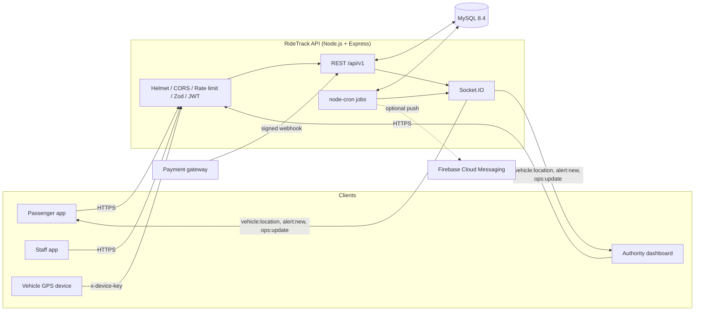
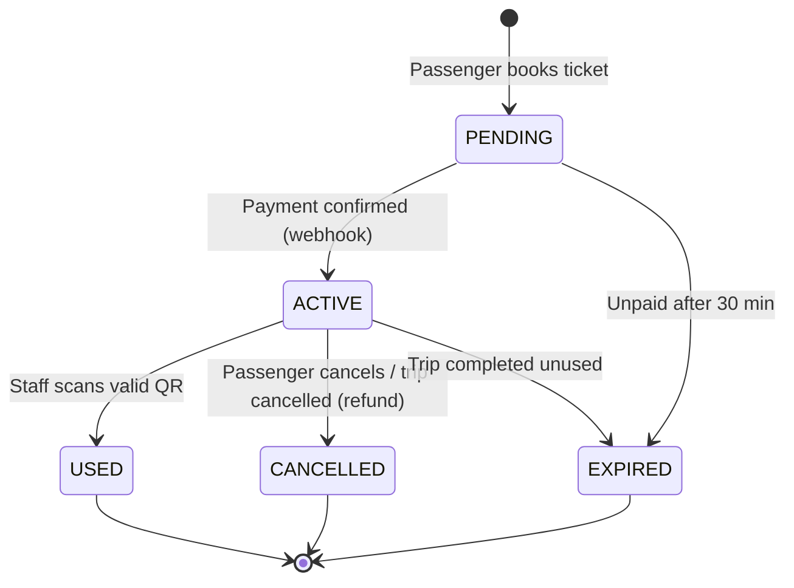
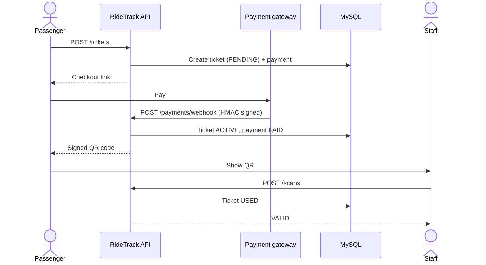
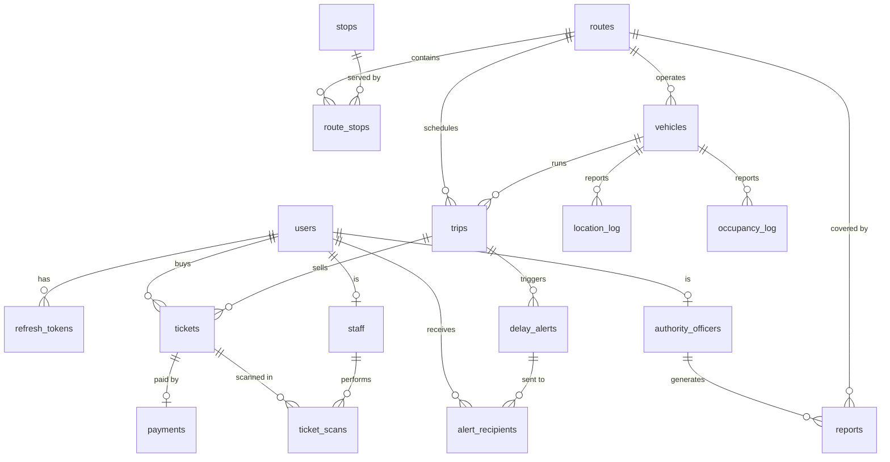

<div align="center">

# 🚍 RideTrack API

**Real-time public transport backend for buses and trains.**<br>
Live tracking · QR ticketing · Payments · Delay alerts


[](https://github.com/sithira-janiya/Ride-Track-Backend/commits/main)
[](https://github.com/sithira-janiya/Ride-Track-Backend)
[](https://github.com/sithira-janiya/Ride-Track-Backend/issues)
[](https://github.com/sithira-janiya/Ride-Track-Backend)


[**Quick start**](#-quick-start) · [**Architecture**](#-architecture) · [**API**](#-api-reference) · [**Real-time**](#-real-time-events) · [**Testing**](#-testing)

</div>

---

## 📊 At a glance

<!-- STATS:START -->
<table>
  <tr>
    <td align="center"><h2>42</h2>REST endpoints</td>
    <td align="center"><h2>17</h2>DB tables</td>
    <td align="center"><h2>10</h2>API modules</td>
    <td align="center"><h2>52</h2>automated tests</td>
    <td align="center"><h2>4</h2>background jobs</td>
    <td align="center"><h2>11</h2>runtime deps</td>
  </tr>
</table>
<sub>Generated by <code>npm run readme</code> from the source on 2026-10-07.</sub>
<!-- STATS:END -->

## 🧭 Overview

RideTrack is the REST + WebSocket backend for a public transport app, built around three roles:

<table>
  <tr>
    <td width="33%" valign="top"><h3>🧑 Passenger</h3>Browse routes and stops, follow vehicles live, buy tickets, get delay alerts.</td>
    <td width="33%" valign="top"><h3>🎟️ Staff</h3>Scan and validate QR tickets, report vehicle occupancy.</td>
    <td width="33%" valign="top"><h3>🛠️ Authority</h3>Manage routes and trips, watch the live dashboard, publish alerts, run reports.</td>
  </tr>
</table>

GPS devices on vehicles authenticate separately with a shared device key.

## ✨ Features

- 🔐 **JWT auth** with short-lived access tokens, rotating refresh tokens and role-based access control (`PASSENGER`, `STAFF`, `AUTHORITY`)
- 📍 **Live tracking**: GPS ingestion, per-route Socket.IO rooms, live ETA vs. timetable
- 🎫 **QR ticketing**: signed QR payloads, staff validation, manual-ID fallback, cancellation
- 💳 **Payments**: pluggable gateway, HMAC-signed webhooks, mock checkout for development
- ⏱️ **Automatic delay detection**: raises an alert when a trip runs 10+ minutes behind
- 🔔 **Alerts** over WebSocket and optional Firebase push notifications
- 📊 **Ops dashboard and reports** for authority officers
- 🖥️ **Admin panel** at `/admin`: a built-in web back office for users, routes, vehicles, trips, tickets, alerts and reports
- 🛡️ **Hardened by default**: Helmet, CORS, rate limiting, Zod request validation, constant-time key comparison
- 🧪 **Integration tests** against a real MySQL test database

## 🏗️ Architecture



### Ticket lifecycle



### Buying a ticket



### Data model



## 🧰 Tech stack

| Layer | Technology |
| --- | --- |
| Runtime | Node.js 20+ (ES modules) |
| Web framework | Express 4, Helmet, CORS, express-rate-limit |
| Real-time | Socket.IO 4 |
| Database | MySQL 8.4 via `mysql2` |
| Validation | Zod |
| Auth | `jsonwebtoken`, `bcryptjs` |
| Scheduling | `node-cron` |
| Testing | Jest, Supertest, socket.io-client |
| Packaging | Docker, Docker Compose |

## 🚀 Quick start

### Prerequisites

- Node.js 20 or newer
- Docker (for MySQL), or your own MySQL 8 instance

```bash
# 1. Install dependencies
npm install

# 2. Configure the environment
cp .env.example .env

# 3. Start MySQL (exposed on port 3307)
docker compose up -d db

# 4. Create the schema and load demo data
npm run migrate
npm run seed

# 5. Run the API with auto-reload
npm run dev
```

The API is now at `http://localhost:3000`. Check it with `GET /health`.

### Run everything in Docker

```bash
docker compose up -d --build
```

This starts MySQL and the API together. The compose file uses throwaway development secrets; set your own for any real deployment.

### Demo accounts

`npm run seed` creates one user per role. All use the demo password from `scripts/seed.js`.

| Role | Email |
| --- | --- |
| 🧑 Passenger | `passenger@ridetrack.test` |
| 🎟️ Staff | `staff@ridetrack.test` |
| 🛠️ Authority | `officer@ridetrack.test` |

> Demo data only. Never seed these accounts into a real deployment.

### Admin panel

Open [http://localhost:3000/admin](http://localhost:3000/admin) and sign in with an authority account (e.g. `officer@ridetrack.test`). From there officers can:

- see live vehicles, delays, today's trips and sales at a glance
- search users, create staff and officer accounts, assign conductors to vehicles, and disable accounts (which also signs them out)
- create and edit routes and stops, add or retire vehicles, schedule trips and change their status
- browse tickets and payments, publish delay/cancellation alerts and run reports

The panel is plain HTML/JS served by the API itself (`src/admin/`), so there is nothing extra to build or deploy.

### Simulate live vehicles

```bash
npm run simulate
```

Drives the seeded vehicles along their routes so you can watch live positions, ETAs and delay alerts without real hardware.

## ⚙️ Configuration

Copy `.env.example` to `.env`. Key variables:

| Variable | Purpose |
| --- | --- |
| `PORT`, `PUBLIC_URL` | Listen port and the public URL used to build payment links |
| `CORS_ORIGIN` | `*` or a comma-separated list of allowed origins |
| `DB_HOST`, `DB_PORT`, `DB_USER`, `DB_PASSWORD`, `DB_NAME`, `DB_SSL` | MySQL connection |
| `JWT_ACCESS_SECRET`, `JWT_ACCESS_TTL`, `JWT_REFRESH_TTL_DAYS` | Token signing and lifetimes |
| `QR_SIGNING_SECRET` | Signs ticket QR payloads |
| `PAYMENT_GATEWAY`, `PAYMENT_GATEWAY_KEY` | Gateway selection and webhook signing key (`mock` for development) |
| `DEVICE_API_KEY` | Shared key GPS devices send as `x-device-key` |
| `FCM_SERVICE_ACCOUNT` | Optional Firebase service-account JSON for push notifications |
| `ENABLE_JOBS` | Toggle background jobs |

Use long random values for every secret in production. `DB_POOL_SIZE` (default 20) sets the MySQL connection pool size.

## ☁️ Deployment

The `Dockerfile` applies the schema (`node scripts/migrate.js`, which is safe to re-run and adds any missing indexes) and then starts the API, so any container host works. These steps use [Railway](https://railway.com):

1. Create a project with **Deploy from GitHub repo** and pick this repository. Railway builds the `Dockerfile` and reads `railway.json` (health check on `/health`, one replica, restart on failure).
2. In the same project, add **New → Database → MySQL**.
3. On the API service's **Variables** tab, set:

   ```text
   NODE_ENV=production
   DB_HOST=${{MySQL.MYSQLHOST}}
   DB_PORT=${{MySQL.MYSQLPORT}}
   DB_USER=${{MySQL.MYSQLUSER}}
   DB_PASSWORD=${{MySQL.MYSQLPASSWORD}}
   DB_NAME=${{MySQL.MYSQLDATABASE}}
   JWT_ACCESS_SECRET=<random>
   QR_SIGNING_SECRET=<random>
   PAYMENT_GATEWAY_KEY=<random>
   DEVICE_API_KEY=<random>
   CORS_ORIGIN=<your front-end origin(s), comma-separated>
   ALLOW_MOCK_PAYMENTS=true
   ```

   Do not set `PORT`: Railway provides it. `PUBLIC_URL` defaults to the service's Railway domain, so set it only for a custom domain. `ALLOW_MOCK_PAYMENTS=true` is required for now: `mock` is the only gateway implemented, and without it the API refuses to start in production.

   Generate each random value with `node -e "console.log(require('crypto').randomBytes(48).toString('base64url'))"`.
4. Under **Settings → Networking**, generate a domain and redeploy (so `RAILWAY_PUBLIC_DOMAIN` is set).
5. Check `https://<your-domain>/health`: it should return `{"status":"ok"}`.

Notes:

- In production the app refuses to start with `PAYMENT_GATEWAY=mock` unless `ALLOW_MOCK_PAYMENTS=true`. That is acceptable for a demo; real payments need a real gateway.
- Run a **single instance**: the latest vehicle positions and Socket.IO rooms live in memory.
- For demo data, open a shell in the running service with `railway ssh` and run `ALLOW_DEMO_SEED=true node scripts/seed.js` (demo accounts only, never on a real deployment). `railway run` does not work for this: it runs on your machine, which cannot reach the private `mysql.railway.internal` host.

## 📡 API reference

Base URL: `/api/v1`. Send `Authorization: Bearer <accessToken>` unless noted. Browsing endpoints (routes, stops, arrivals) are public. Roles are enforced server-side.

<details open>
<summary><b>Auth and users</b></summary>

| Method | Endpoint | Access | Description |
| --- | --- | --- | --- |
| `POST` | `/auth/register` | 🌐 Public | Create an account |
| `POST` | `/auth/login` | 🌐 Public | Obtain access and refresh tokens |
| `POST` | `/auth/refresh` | 🌐 Public | Rotate the refresh token |
| `GET` | `/users/me` | 🔑 Any user | Current profile |
| `PATCH` | `/users/me` | 🔑 Any user | Update profile |
| `PUT` | `/users/me/push-token` | 🔑 Any user | Register a push token |

</details>


<details open>
<summary><b>Routes, stops and trips</b></summary>

| Method | Endpoint | Access | Description |
| --- | --- | --- | --- |
| `GET` | `/routes` | 🌐 Public | List routes |
| `GET` | `/routes/:id` | 🌐 Public | Route details |
| `GET` | `/routes/:id/arrivals` | 🌐 Public | Upcoming arrivals |
| `GET` | `/routes/:id/vehicles` | 🌐 Public | Live vehicles on the route |
| `POST` / `PATCH` | `/routes`, `/routes/:id` | 🛠️ Authority | Create or update routes |
| `POST` | `/routes/:id/stops` | 🛠️ Authority | Add a stop to a route |
| `GET` | `/stops/nearby` | 🌐 Public | Stops near a coordinate |
| `POST` / `PATCH` | `/trips`, `/trips/:id` | 🛠️ Authority | Schedule or update trips |

</details>


<details open>
<summary><b>Tickets, payments and scans</b></summary>

| Method | Endpoint | Access | Description |
| --- | --- | --- | --- |
| `POST` | `/tickets` | 🧑 Passenger | Book a ticket |
| `GET` | `/tickets`, `/tickets/:id` | 🧑 Passenger | List or view own tickets |
| `POST` | `/tickets/:id/cancel` | 🧑 Passenger | Cancel a ticket |
| `POST` | `/payments/webhook` | Gateway (`x-signature`) | HMAC-SHA256 signed payment callback |
| `GET` / `POST` | `/payments/mock/*` | Mock gateway only | Development checkout page |
| `POST` | `/scans` | 🎟️ Staff | Validate a ticket QR |
| `GET` | `/trips/:id/scans` | 🎟️ Staff, 🛠️ Authority | Scans for a trip |

</details>


<details open>
<summary><b>Vehicles, alerts and operations</b></summary>

| Method | Endpoint | Access | Description |
| --- | --- | --- | --- |
| `POST` | `/vehicles/:id/location` | Device key | Submit a GPS position |
| `POST` | `/vehicles/:id/occupancy` | 🎟️ Staff | Report occupancy |
| `GET` | `/alerts` | 🧑 Passenger, 🛠️ Authority | List alerts |
| `PATCH` | `/alerts/:id/read` | 🧑 Passenger | Mark an alert read |
| `POST` | `/alerts` | 🛠️ Authority | Publish an alert |
| `GET` | `/ops/dashboard` | 🛠️ Authority | Live operations summary |
| `GET` | `/reports` | 🛠️ Authority | Route, delay and occupancy reports |
| `GET` | `/health` | 🌐 Public | Liveness and database check |

</details>

<details>
<summary><b>Admin</b></summary>

| Method | Endpoint | Access | Description |
| --- | --- | --- | --- |
| `GET` | `/admin/overview` | 🛠️ Authority | Headline counts: users, fleet, today's trips and sales |
| `GET` | `/admin/users` | 🛠️ Authority | Search and filter users |
| `POST` | `/admin/users` | 🛠️ Authority | Create a staff or officer account |
| `PATCH` | `/admin/users/:id` | 🛠️ Authority | Enable/disable an account, assign a staff vehicle |
| `GET` | `/admin/routes` | 🛠️ Authority | All routes, including inactive ones |
| `GET` | `/admin/vehicles` | 🛠️ Authority | All vehicles |
| `POST` | `/admin/vehicles` | 🛠️ Authority | Add a vehicle |
| `PATCH` | `/admin/vehicles/:id` | 🛠️ Authority | Edit or retire a vehicle |
| `GET` | `/admin/trips` | 🛠️ Authority | Trips on a given day |
| `GET` | `/admin/tickets` | 🛠️ Authority | Tickets with payment status |

</details>

## ⚡ Real-time events

Connect with a valid access token. Subscribe to a route, then listen for live updates:

```js
const socket = io(API_URL, { auth: { token: accessToken } });
socket.emit('route:subscribe', { routeId: 1 });
socket.on('vehicle:location', (pos) => console.log(pos));
```

 Every user joins a private `user:<id>` room; authority users also join `ops`.

| Direction | Event | Payload |
| --- | --- | --- |
| Client → Server | `route:subscribe` / `route:unsubscribe` | `{ routeId }` |
| Server → Client | `vehicle:location` | Live position for a subscribed route |
| Server → Client | `vehicle:occupancy` | Occupancy update for a subscribed route |
| Server → Client | `alert:new` | Personal alert (delay, cancellation, route change) |
| Server → Client | `ops:update` | Change notification for the ops dashboard |

## ⏰ Background jobs

| Schedule | Job | Purpose |
| --- | --- | --- |
| Every minute | `advanceTrips` | Moves trips `SCHEDULED → ONGOING → COMPLETED` by the clock |
| Every minute | `expireTickets` | Expires unpaid tickets (30 min), refunds and cancels tickets on cancelled trips |
| Every 2 minutes | `detectDelays` | Compares live ETA with the timetable and raises a `DELAY` alert at 10+ minutes late |
| Daily 03:30 | `purgeOldLocations` | Prunes old GPS history |

## 🗂️ Project structure

```text
├── db/schema.sql            # MySQL schema
├── docker/                  # DB init scripts (test database)
├── scripts/                 # migrate, seed, simulate
├── src/
│   ├── app.js               # Express app and route wiring
│   ├── admin/               # admin panel (static HTML/JS/CSS, served at /admin)
│   ├── server.js            # HTTP + Socket.IO bootstrap
│   ├── config/              # env and DB pool
│   ├── middleware/          # auth, validation, error handling
│   ├── modules/             # auth, users, routes, vehicles, tickets,
│   │                        # payments, scans, alerts, ops, admin
│   ├── realtime/            # Socket.IO rooms and emitters
│   ├── jobs/                # cron jobs
│   └── utils/               # ETA, geo, errors, async helpers
└── tests/                   # Jest integration and unit tests
```

## 🧪 Testing

Tests run against a real MySQL test database, created by `docker/init-test-db.sql` when the `db` container first starts.

```bash
docker compose up -d db
npm test
```

## 🔒 Security notes

- Secrets are read from environment variables; `.env` is git-ignored.
- Payment webhooks are verified with HMAC-SHA256 over the raw request body.
- Device and signature comparisons are constant-time.
- Request bodies are capped at 100 KB and validated with Zod; request logs record paths only, never queries or bodies.
- The mock payment gateway must be explicitly enabled (`ALLOW_MOCK_PAYMENTS=true`) and is for demos only.

## 🔄 Keeping this README current

The **At a glance** numbers are generated from the code. After adding endpoints, tables, tests or jobs, run:

```bash
npm run readme
```

Last-commit, size, issue and star badges update themselves from GitHub.

## 📄 License

Released under the MIT License (see `package.json`).
